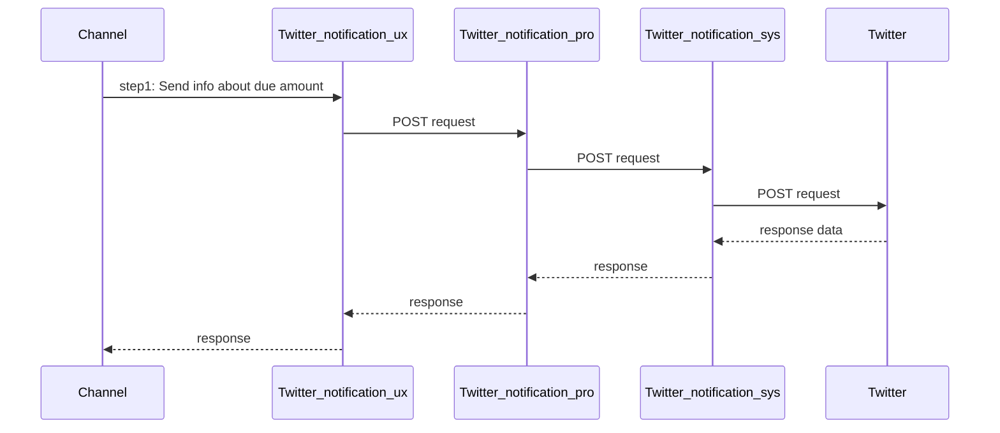

# Twitter Notification API

## Background

Currently in CWC & CWP markets, it is necessary to include a new way by which our clients can be notified once their new invoice is generated, this in order to avoid delinquent invoices due to the non-validation of the invoice by the client.

## Benefits

- Another way to receive the invoice. 
- Interaction in social networks with our clients. 
- Automated process.

## Request

- It is necessary to update customer data to obtain the twitter user of each one

  

## Scope

- Automatic sending of direct messages once the customer's billing cycle is executed

## Not in Scope  

* Capture of customer data

  

## Solution Overview

* 

## Uses Cases

| UC#  | Use Case            | Description                                                  | Comment |
| ---- | ------------------- | ------------------------------------------------------------ | ------- |
| 1    | DM about due amount | Billing system send information about the userInfo and some information in the invoice |         |

## Process Proposed 

###  Raise the order

### Sumary of API's

| ApiName                                              | serviceName      | Description                                                  | Comment |
| ---------------------------------------------------- | ---------------- | ------------------------------------------------------------ | ------- |
| [twitter-notification-ux](twitter-notification-ux)   | sendDM           | send information about the bill                              |         |
| [twitter-notification-pro](twitter-notification-pro) | sendDM           | routes the information received from the previous layer      |         |
| [twitter-notification-sys](twitter-notification-sys) | sendDM           | communicates with the Twitter api to send messages           |         |
|                                                      | retrieveNumberId | get the id number needed to send direct messages from the Twitter api |         |

