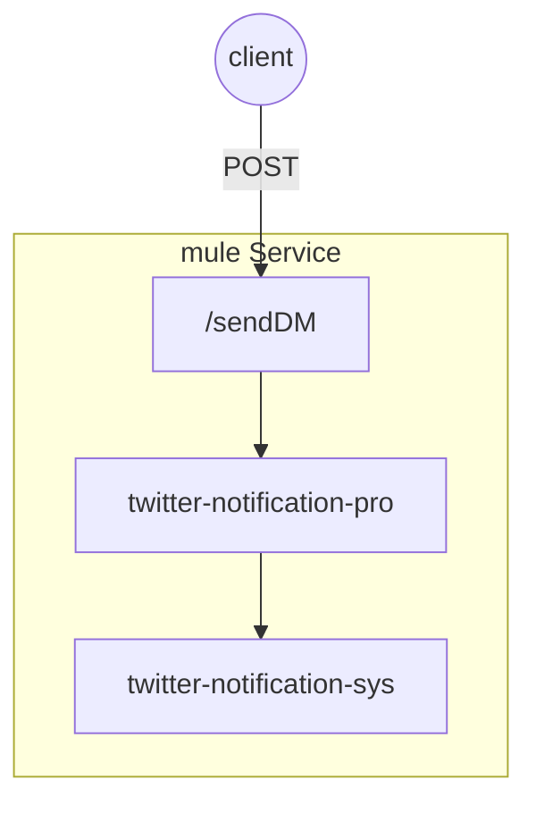
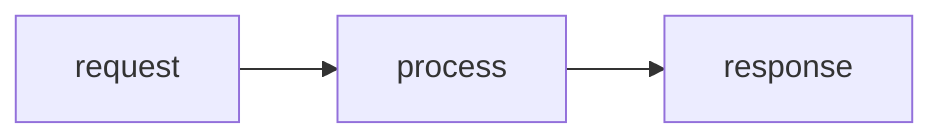

# sendDM

send information about the bill

## Solution Architecture



## POST

### Process Diagram



### Sequence Diagram

### HTTP Endpoints

| Path                                                         | http Method | Body MIME type |
| ------------------------------------------------------------ | ----------- | -------------- |
| **{protocol}://{host}:{port}**/Twitter-notification-pro/v1/{bussinessId}/message/{id} | POST        | JSON           |


### Headers

Definition of headers for the request.

| name | type | description |
| ---- | ---- | ----------- |
|      |      |             |


### URI Params

Definition of uri parameters for the request.

| name       | type   | description                                                  | required |
| :--------- | ------ | ------------------------------------------------------------ | -------- |
| businessId | String | 2 letter ISO 3166 country code  (TT, BB, JM, PA, etc.) identifying the business unit. <br />Enum values:<br />CO-Colombia<br/>PA-Panama<br/> | Y        |
| id         | String | customer's Userid                                            |          |

### Query Params

Definition of query parameters for the request.

| name | type | description | required |
| ---- | ---- | ----------- | -------- |
|      |      |             |          |


### Body Request

Definition of body request.

```json
{
    "id":"2345678900001",
    "name":"Joe",
    "lastName": "Doe",
    "twitterUser":"@JoeDoe",
    "billingCicle":"5",
    "balanceDue":"0.00",
    "lastBill":"65.00",
    "dueDate":"2019-01-01T00:00:00.000Z"
    
}
```

#####  Body   Details

| name         | type   | description                              | required |
| ------------ | ------ | ---------------------------------------- | -------- |
| id           | string | customer account number                  | Y        |
| name         | string | customer name                            | Y        |
| lastName     | string | customer last name                       | N        |
| twitterUser  | string | twitter user associated with the account | Y        |
| billingCicle | string | billing cut-off day                      | Y        |
| balanceDue   | string | overdue amount                           | Y        |
| lastBill     | string | amount of the last invoice               | Y        |
| dueDate      | string | invoice due date                         | Y        |


### Response

Definition of all response types.

#### 200

```json
{  
    "code": 200,
 	"message": "Message sent successfully"
}
```

#####  Body   Details

| name | type | description | required |
| ---- | ---- | ----------- | -------- |
|      |      |             |          |

#### 401

Unauthorized - The request has not been applied because it lacks valid authentication credentials for the target resource.

```json
{
  "errors" : [{     
      "code" : 401,
      "message" : "The user could not be authenticated for this request.",
      "description" : "The request has not been applied because it lacks valid authentication credentials for the target resource"
    }
  ]
}
```

#### 404

Not Found - server has not found a resource with that URI. This may be temporary and permanent condition. This status code is commonly used when the server does not wish to reveal exactly why the request has been refused, or when no other response is applicable.

```json
{
  "errors" : [{
     
      "code" : 404, 
       "message" : "The request is invalid or not properly formed.",
      "description" : "The requested operation failed because a resource associated with the request could not be found."
    }
  ]
}
```

#### 500

Internal Server Error - server encountered an error processing request. This should not happen normally, but it is a generic error message, given when no more specific message is suitable.

```json
{
  "errors" : [{
      "code" : 500,
      "message" : "The request failed due to an internal error.",
      "description": "error description"
    }
  ]
}
```

#### 503

Service Unavailable - temporary maintenance of service, try again later. The implication is that this is a temporary condition which will be alleviated after some delay. If known, the length of the delay will be indicated in a Retry-After header. If no Retry-After is given, the client SHOULD handle the response as it would for a 500 response. Note: The existence of the 503 status code does not imply that a server will use it when becoming overloaded. Servers may simply refuse the connection.